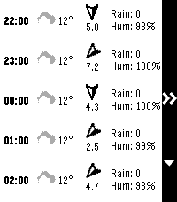
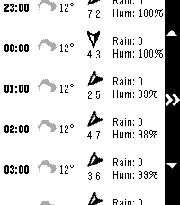
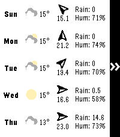
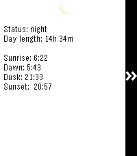

# HA Forecast Pebble

Simple Pebble watchapp to display the hourly and daily forecast from a Home Assistant weather service. Written with Alloy (Moddable) using Piu.

You will need to configure a Home Assistant URL, long lived token and weather sensor in the settings on your phone.

## Features

- Lists full hourly forecast for 24 hours ahead. 
- Lists 5 day daily forecast
- For each, shows condition, temperature, wind speed and direction, rain amount and humidity.
- Shows sunrise, sunset, dawn and dusk times, and day length
- Up and down to scroll, select to cycle

## TODO
- 12 hour clock, but we are damn tight on memory
- I could possibly make ForecastRow a function to save a bit but it's ugly and I already went to a custom class over Piu's template function.

## Screenshots

